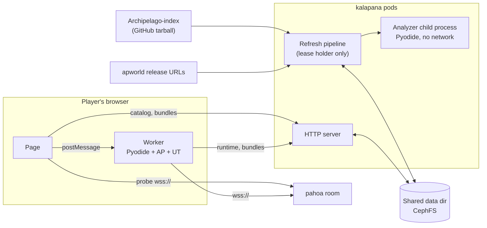

# Kalapana: Universal Tracker on the web

Kalapana runs Archipelago's Universal Tracker (UT) in the browser at `ut.ionium.us`. Players open a link, and the tracker connects to their room with no install. Python runs in the browser via Pyodide (WebAssembly).

This document describes the architecture of the test instance. It builds on the spikes in `spikes/`, all of which passed in Node, headless Chrome 153 and Firefox 155. The live test ran against a pahoa room on `mw.ionium.us`. For operating details (configuration, endpoints, development), see the README.

## Summary

- **The browser does the tracking.** The page reads the room's datapackage checksums, loads the matching world bundle, and runs the unmodified `tracker.apworld` in a Web Worker. Game data never passes through kalapana's server.
- **The server keeps a catalog of world bundles.** A small Node service (no npm dependencies) fetches the curated Archipelago-index at startup and when an admin POSTs `/admin/refresh`. It downloads every locked apworld version and analyzes each new one. It then publishes `catalog.json`, which maps each game and datapackage checksum to a precompiled bundle.
- **Apworld analysis is sandboxed.** Analyzing an apworld means importing it, which runs arbitrary Python. Each import runs in a child Node process with Pyodide under Node's permission model: no network, no child processes, no environment, and file writes only in its own job directory.
- **Several pods share one data directory.** CephFS in production. A renewable lease file ensures only one pod processes apworlds at a time; everything else is atomic writes.
- **The image pins its inputs.** Archipelago (matching the index's `archipelago_version`), Pyodide, UT and a few wheels are all pinned by sha256. GitLab CI builds it with buildah, like puna.

## What the spikes established

| Question | Result |
|---|---|
| Python runtime | Pyodide 0.29.x (Python 3.13). AP's `ModuleUpdate` rejects 3.14. |
| UT compatibility | The unmodified `tracker.apworld` runs behind a small Kivy-free bridge. |
| Correctness | In-logic lists match desktop UT exactly: TUNIC 107/114, Stardew 21/10/32 during live play. |
| Update latency | 2 to 6 ms per tracker update for TUNIC and Stardew. |
| Networking | A browser `WebSocket` shim works against pahoa over TLS. |
| Threads | Not available in Pyodide. An inline executor covers the world that uses a thread pool at import. |
| Persistence | IDBFS and OPFS both survive a full browser restart in Chrome and Firefox. |
| Packages | Core needs only `pyyaml`. `bsdiff4`, `jellyfish` and `ModuleUpdate` are replaced by stubs, and so is `ssl` unless a world uses `requests`, in which case Pyodide's real `ssl` is loaded. |
| Bundles | Precompiled `.pyc` bundles cost about 1 MB more on a cold load but import up to a second faster. |
| Sandbox | Under the analyzer's permissions, host reads, writes outside the job, processes, workers and network are all denied, even from code that reaches Node's `process`. |

## Architecture



### Server

- **HTTP** (`server/http.mjs`) serves:
  - the web app;
  - the vendored Pyodide runtime at `/runtime/pyodide-<version>/`;
  - core and world bundles at `/bundles/...`, named by content key and immutable;
  - `catalog.json`;
  - health endpoints and the admin endpoints.

  Text assets are compressed with brotli or gzip on first request and cached in memory. Zips are served as-is.
- **Refresh pipeline** (`server/refresh.mjs`). Any pod can request a refresh; it leaves a request file in the data directory. The pod holding the lease processes requests until none remain:
  1. **Core bundle:** build it if the current key has none. The key covers the pinned inputs and kalapana's runtime and analyzer code.
  2. **Tracker:** analyze the pinned `tracker.apworld`.
  3. **Index:** download the tarball and parse it in the sandbox with `tomllib`. Refuse to continue if its `archipelago_version` differs from the image's.
  4. **Resolve versions** with the lobby's rules: skip disabled worlds, take supported worlds from the AP source, and map each version to a `local` file, its own `url`, or `default_url` with `{{version}}` substituted.
  5. **Download** anything missing, verifying the sha256 from `index.lock` when present. Store files as `apworlds/<sha256>.apworld`.
  6. **Analyze** every apworld without a cached result.
  7. **Publish** `catalog.json` and `last-refresh.json`, the summary with failures.
- **Analyzer** (`server/sandbox.mjs`, `analyzer/`). Each task is a child `node --permission` process running Pyodide:
  - **`build_core`** builds `core.zip` (precompiled) and `core-src.zip` (sources, for the analyzer), then smoke-tests importing `worlds`, `CommonClient` and `Generate`.
  - **`analyze_world`** imports one world alone. It records every registered game's datapackage checksum, whether UT needs a YAML (`ut_can_gen_without_yaml`), whether UT is disabled, whether the map needs an external poptracker pack, and which Pyodide packages the world imported. It then writes a reproducible precompiled bundle.
- **Caching.** Completed analyses, including failures, are cached under a key that combines the apworld sha256 with a hash of the analyzer's context: the pinned inputs, the analyzer tasks and the stubs it imports. Crashes and timeouts aren't cached, so they are retried. Changing the analyzer therefore retries earlier failures, and bundle URLs change with it. Changing browser-only modules (the bridge and the WebSocket shim) rebuilds only the core bundle.

### Browser

- **Page** (`web/app.mjs`):
  1. Load `catalog.json`.
  2. On Connect, open a short `wss://` probe and read `RoomInfo`. If the room has more than one game, send a tracker `Connect` to learn the slot's game from `Connected.slot_info`. A refused slot or password is reported here.
  3. Choose the newest catalog entry whose checksum matches the room's checksum for that game.
  4. If the entry needs a YAML, require one; if its map needs an external pack, offer an optional upload.
  5. Start the worker.

  The page follows puna's look, with its light, dark and system theme selector. Server, slot and password are kept in localStorage so a reload doesn't clear them. The last 5 distinct combinations that connected are offered in a Recent menu.

  While a tracker runs, Connect becomes Disconnect. Disconnecting terminates the worker, so no Python state, uploaded file or map image carries over to the next room, slot or game, and the next Connect boots a fresh worker (about 2 seconds with the runtime cached). Picking a different Recent entry while tracking disconnects and connects to it; while idle it only fills the fields. A room check still in flight is ignored if the details change before it answers.

  The gear menu has one saved option, streamer mode. It hides the room's port in the address field (except while the field is being edited) and in the status line. The log and the Recent menu still show it. `spikes/07-kalapana/switch.mjs` checks this.
- **Worker** (`web/worker.mjs`):
  1. Load Pyodide from kalapana and the packages the entries list.
  2. Unpack the core, tracker and world bundles at `/`, and place the uploaded files.
  3. Run `kalapana_boot.prepare()` and install the WebSocket shim.
  4. Start the bridge and connect UT.
- **Bridge** (`runtime/ui_bridge.py`). It stands in for the Kivy widgets UT touches: tracker list, header labels, map markers and images, and the `ui` object. It sends their updates to the page:
  - server text as Kivy-style `[color=name]` markup, not ANSI escapes. The page maps each name to a CSS token with light and dark values;
  - nested message lists from `/explain` flattened;
  - the startup generation skipped when no YAML was supplied, since UT regenerates YAML-less worlds on connect;
  - connection state, shown as a dot and a sentence as on puna's journal page.
- **Reconnecting.** The bridge replaces CommonClient's autoreconnect with the journal page's policy:
  - after a drop it retries with a jittered delay that doubles from 1 second up to 30;
  - while the tab is hidden the connection stays open, but a lost connection isn't retried until the tab is shown again;
  - showing the tab or the browser coming back online retries immediately.

  The page can't see WebSocket pings, so a watchdog sends a harmless `Get` after 20 seconds without traffic and abandons the connection after 45. `spikes/07-kalapana/reconnect.mjs` checks this against a real server that is killed, restarted and frozen.

### Shared data directory

```
catalog.json                  published catalog
last-refresh.json             summary of the last published refresh, including failures
refresh.lease                 lease file (owner, expiry)
refresh-requested.json        pending refresh request
apworlds/<sha256>.apworld     downloads
apworlds/unlocked-downloads.json   URL -> sha256 for versions index.lock doesn't cover
core-v1/<key>/                core.zip, core-src.zip, result.json
analysis-v1/<key>/            bundle.zip, result.json (key = hash of analyzer context and apworld sha256)
```

**Locking.** The lease is created with `link()`, which is atomic and never exposes a half-written file, and renewed every 30 seconds with a 90-second expiry. An expired lease is taken over by renaming it aside. The contender checks it moved the stale lease it read, and puts a live lease back if not. A holder that finds someone else's owner id stops processing. Published files and directories are written under temporary names and renamed into place.

## Catalog

```json
{
  "schema": 1,
  "archipelagoVersion": "0.6.7",
  "pyodide": { "version": "0.29.4", "base": "/runtime/pyodide-0.29.4/" },
  "core": { "bundle": "/bundles/core/<key>.zip", "packages": ["pyyaml"] },
  "tracker": { "version": "0.3.3", "bundle": "/bundles/worlds/<key>.zip", "packages": ["pyyaml"] },
  "games": {
    "TUNIC": [
      { "module": "tunic", "version": "0.6.7", "source": "core", "checksum": "c2cfbd...",
        "bundle": "/bundles/worlds/<key>.zip", "packages": ["pyyaml"], "needsYaml": false,
        "disableUt": false, "map": { "externalPack": true, "internalPack": false } }
    ]
  }
}
```

**Checksum ambiguity.** Entries are sorted newest first. A datapackage checksum only covers item and location names and ids, so versions that changed logic without renaming anything share a checksum (ANIMAL WELL 0.5.0 and 0.5.2 do). The browser takes the newest match. That may not be the version the room generated with; the room's apworld version isn't available anywhere the browser can see.

## Container and deployment

- **Image.** `deploy/Dockerfile` has two stages:
  1. `node:26-trixie-slim` runs `deploy/fetch-inputs.mjs`, which downloads and verifies `deploy/inputs.json`;
  2. `node:26-trixie-slim` with the vendored inputs and kalapana's code, running as `node` (158 MB locally).

  Node 26 is required for the permission model's `--allow-net`.
- **CI.** `.gitlab-ci.yml` runs `node --test` and syntax checks, then buildah with `:sha-<short>` on every branch, `:latest` on `main` and `:dev` on `ionium-dev`. No deploy job.
- **Kubernetes.** Manifests live outside the repo, as with puna. The pod needs:
  - `/data` on the shared RWX volume;
  - the admin token from a Secret (`KALAPANA_ADMIN_TOKEN_FILE`);
  - `/healthz` for liveness and `/readyz` for readiness;
  - egress to GitHub for the index and apworld downloads.

  Envoy terminates TLS. The deployment sets `enableServiceLinks: false`, although the server also ignores the `KALAPANA_PORT=tcp://...` value Kubernetes injects for a Service named `kalapana`.
- **Resources.** Each analyzer process peaks at about 250 MB. In the cluster, the first refresh on an empty volume took about 20 minutes with 4 analyzers, peaking at about 870 MiB working set and 6 cores; the other replica stayed under 80 MiB. Once the cache is warm, only new index versions are processed.
- **Hostnames.** Nothing in the server or web client names a hostname, so moving from `ut.ionium.us` to kalapana's own domain is an infrastructure change only. Keep it that way.
- **Headers.** HTML gets a Content Security Policy:
  - `script-src 'self' 'wasm-unsafe-eval'`;
  - `connect-src 'self' wss: ws:`;
  - `img-src 'self' blob: data:`;
  - `frame-ancestors 'none'`.

  Every response gets `nosniff`, `no-referrer` and `Cross-Origin-Resource-Policy: same-origin`. Runtime and bundle files are `immutable`; the app and catalog are `no-cache` with ETags.

## Handoff from puna

Deferred. The agreed direction:
- **Link.** A per-slot "Track in browser" link on puna's room page, with the server, slot and game in the URL fragment. The page reads it and strips it with `history.replaceState`.
- **Password, testing.** Base64url-encoded in the fragment. This only prevents casual reading.
- **Password, launch.** A single-use handoff token of about 60 seconds, redeemed with one cookie-less CORS request to puna, so the password never appears in a URL.
- **Known hosts.** The page auto-connects only to known room hosts, and asks before connecting anywhere else.

Until then, the page accepts `?address=&slot=` in the query string. It never accepts a password there.

## Isolation and cookies

- **Same-site risk.** Browsers draw cookie boundaries at the site (scheme plus registrable domain). Every `*.ionium.us` host is the same site as puna (`mw.ionium.us`) and the lobby (`ap-lobby.ionium.us`), and both rely on `SameSite=Lax` cookies without CSRF tokens.
- **Testing.** The test instance runs on `ut.ionium.us` and executes only curated index worlds, core worlds and UT. There are no uploaded apworlds, and YAMLs and poptracker packs are data.
- **Guard.** Recommended for puna and the lobby regardless: reject state-changing requests unless `Sec-Fetch-Site` is `same-origin` (or `none`), with an `Origin` fallback.
- **Full launch.** Kalapana moves to a separate registrable domain, which also blocks cookie tossing. Only then are uploaded apworlds allowed.
- **Server side.** Index apworlds run only inside the analyzer sandbox. The server process itself never imports them.

## Known limitations

- **Native dependencies.** Worlds needing native packages fail analysis and don't appear in the catalog (for example soe, which the index also disables).
- **Rooms without TLS** can't be reached from an https page.
- **No saved library yet.** The test instance doesn't keep uploaded YAMLs and packs between visits. OPFS persistence was proven in the spikes but isn't wired in.
- **Missing UI.** No hints tab, command autocomplete, map groups or location icons yet.
- **Saved password.** The room password is kept in plain text in the browser's localStorage, along with the Recent list.
- **Safari** is untested.
- **Randomized YAML options.** UT's own limitation still applies: they need the rolled values filled in.

## Open decisions

1. **Handoff token details.** Token lifetime, and whether redeeming requires the room to be running.
2. **Guard.** Approve the `Sec-Fetch-Site` check as HANDOFFs to puna and the lobby?
3. **UT pinning.** Keep `tracker.apworld` pinned in `deploy/inputs.json`, or add it to Archipelago-index?

## Milestones

1. **Test instance** (this). Server refresh and sandboxed analysis, catalog, browser client, image and CI. Verified end to end locally against AP 0.6.7 rooms for TUNIC (with map) and Stardew (with YAML), and in the container.
2. **Deploy to `ut.ionium.us`** on the shared volume. Test against a live pahoa room.
3. **Client polish:** persistent library, hints tab, autocomplete, map groups and icons.
4. **Puna handoff:** link, guard, then token.
5. **Launch:** separate domain, uploaded apworlds, Safari pass.
